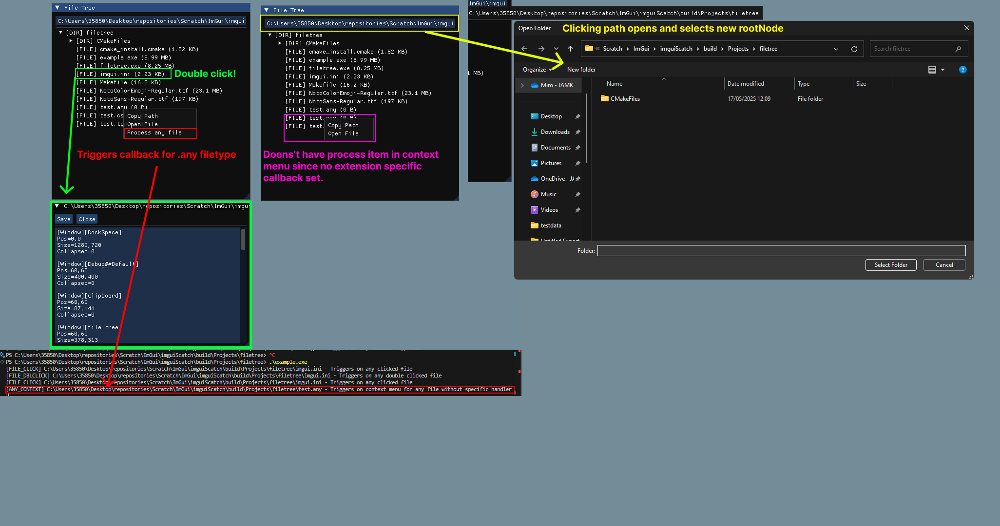

# FileTree
Learning repository. Imgui filetree with callbacks onClick, onDoubleClick and onContextMenu with extension specific variants. If u wanna use this i recommend stripping away the callback system and actually making something good or using ImGui stuff raw.


# Rendering
There are some behavior that isnt controller trough the callbacks. For example double clicking a file in filetree will open readonly preview of the file.
```cpp
static std::shared_ptr<FileTree> fTree = std::make_shared<FileTree>();
static FileTreeRenderer r(fTree);
r.Render();
```

# FileTree
Too bad no information about filetree. Defaults to current project directory when constructred.
# Callback examples
Bad implementation of a callback system. Split into two: **General** and **Extension specific**
## Extension Callback Example 

Incase you add **RegisterExtensionCallback** the filetree will automatically add ImGui::MenuItem to ImGui::ContextMenu in [File Tree Context Menu Implementation](rendering/FileTreeRenderer.cpp#L132). You can also see this in the See the Check out the [example][screenshot1] for a visual example. <span style="color:red">red</span> and <span style="color:magenta">purple</span> boxes compares effect of this functionality.
```cpp
r.RegisterExtensionCallback(".any", FileTreeRenderer::CallbackType::ContextMenu, [](const std::filesystem::path& path) {
    std::cout << "[ANY_CONTEXT] " << path.string() << " - Triggers on context menu for any file without specific handler" << std::endl;
});

```
## General file callbacks
```cpp
// File callbacks
r.RegisterFileCallback(FileTreeRenderer::CallbackType::Click, [](const std::filesystem::path& path) {});
r.RegisterFileCallback(FileTreeRenderer::CallbackType::DoubleClick, [](const std::filesystem::path& path) {});
r.RegisterFileCallback(FileTreeRenderer::CallbackType::ContextMenu, [](const std::filesystem::path& path) {});
```

## General directory callbacks
```cpp
// Director callbacks
r.RegisterDirectoryCallback(FileTreeRenderer::CallbackType::Click, [](const std::filesystem::path& path) {});
r.RegisterDirectoryCallback(FileTreeRenderer::CallbackType::DoubleClick, [](const std::filesystem::path& path) {});
r.RegisterDirectoryCallback(FileTreeRenderer::CallbackType::ContextMenu, [](const std::filesystem::path& path) {});
```


## Extension specific callbacks 
```cpp
// Generic "any" extension callbacks
r.RegisterExtensionCallback(".any", FileTreeRenderer::CallbackType::Click, [](const std::filesystem::path& path) {});
r.RegisterExtensionCallback(".any", FileTreeRenderer::CallbackType::DoubleClick, [](const std::filesystem::path& path) {});
r.RegisterExtensionCallback(".any", FileTreeRenderer::CallbackType::ContextMenu, [](const std::filesystem::path& path) {});
```

[screenshot1]: example.png